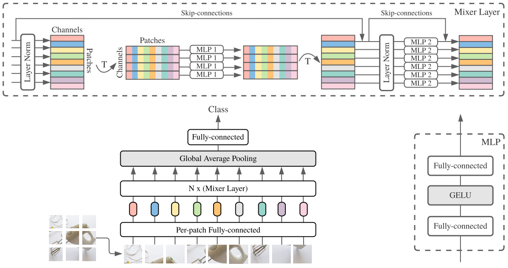

# MLP Mixer Implementation



## Overview

This repository contains a PyTorch implementation of the MLP-Mixer architecture, as introduced in the paper "MLP-Mixer: An All-MLP Architecture for Vision". MLP-Mixer is a variant of the Transformer model, where the attention layer is replaced by a multi-layer perceptron (MLP) that operates across image patches or tokens in NLP tasks. 

Our implementation of the MLP-Mixer serves as a drop-in replacement for the self-attention layer in standard Transformer models, requiring only a few lines of code to transpose the tensor and apply the MLP across the sequence dimension. 

Currently, I have experimented with applying the MLP-Mixer to MNIST and CIFAR10 datasets for training. 

## Usage

1. Install the necessary python package with `requirements.txt`
```
pip install -r requirements.txt
```
2. You can adjust the hyperparameters in `config.py`
3. You can run the training script with `train.py`
```
python train.py
```

## References

- [MLP-Mixer: An All-MLP Architecture for Vision](https://arxiv.org/abs/2105.01601)
- [(GitHub) Ardawanism - MLP-Mixer-An-all-MLP-Architecture-for-Vision](https://github.com/Ardawanism/MLP-Mixer-An-all-MLP-Architecture-for-Vision)
- [(YouTube) Neural Black Magic - MLP-Mixer: An all MLP Architecture for Vision explained (with implementation in PyTorch)](https://www.youtube.com/watch?v=-GWBVpZ0bxI)


